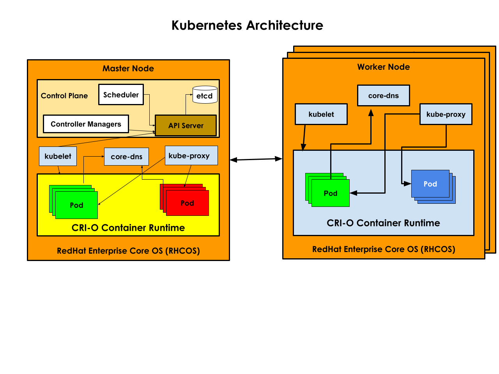

# Day - 1 - Kubernetes 

## Hypervisor ( Virtualization Technology )
- helps you in running 2 or more Operating Systems side by side on the same machine
- Intel Processor
  - the virtualization feature is called VT-X
- AMD Processor
  - the virtualization feature is called AMD-V
- Popular Hyversior Softwares
 - VMWare
   - Workstation ( Type 2 Hypervisor runs on top of Host OS )
   - Player ( Type 2 Hypervisor runs on top of Host OS )
   - Fusion ( Mac OS-X) - Type2
   - vSphere ( Bare Metal Hypervisor ) - Type 1
 - Oracle
   - VirtualBox ( Type2 )
 - Parallels ( Mac OS-X )
 - Microsoft
   - Hyper-V
 - Virtual Machines ( Guest OS )
     - hosts a full functional operating system
     - requires dedicated hardware resources
       - dedicated CPU Cores
       - dedicated RAM
       - dedicated Storage
     - has dedicated OS Kernel
  
## Container Technology
- an application virtualization technology
- containers are nothing but application process that runs in a separate namespace
- containers shares the hardware resources on the OS where they are running
  - shares OS kernel
  - shares CPU Core
  - shared RAM
  - shares Storage ( HDD/SSD )
- lightweight virtualization technology unlike Hypervisor

## What makes people compare containers with virtual machine?
- containers just like VMs has their own IP Address
- containers just like VMs has their own network stack
- containers just like VMs has their own shell/command prompt
- it is for these reasons people tend to compare a container with a VM
- but containers are mere application process and containers are not OS
- while VMs are a fully functional Operating System
- containers typically has one application per container

## Container Engines
- Docker is one of most popular Container Engine
- CRI-O is a container runtime that is used in RedHat OpenShift
- containerd
- LXC
- Podman is also gaining popularity

## What is Container Orchestration Platform ?
- helps us in managing containers
- self healing platform
- also helps in making the deployed applications Highly Available ( HA )
- also helps in scaling up/down your application on demand
- in built monitoring capabilities backed by controllers
  - automatically monitors the health of your application and heals them when required
  - load balancing
- supports different types of services ( internal and external services )
- helps in application rolling update
  - upgrading your application from one version to other without any down-time

## What are the various container orchestration platforms available?
- Docker SWARM
   - only support Docker container engine
- Google Kubernetes
   - supports many different container engines including Docker
- RedHat OpenShift
   - supports many different container engines including Docker
- AWS EKS ( Managed Kubernetes from Amazon - SaaS )
- Azure AKS ( Managed Kubernetes from Microsoft - SaaS )
- AWS ROSA ( Managed RedHat OpenShift from Amazon - SaaS  )
- Azure OpenShift Service ( Managed RedHat OpenShift from Microsoft - SaaS )

# Lab Setup
Dell Server ( Server 1 )
RAM - 512 GB RAM
64 Physical Cores 
6TB HDD Storage

Used by 8 participants
OpenShift Server IP - 192.168.1.121
Credentials 
  - user : user1 thru user8
  - password: Admin@123

Dell Server ( Server 2 )
RAM - 512 GB RAM
64 Physical Cores 
Used by 7 participants
6TB HDD Storage
OpenShift Server IP - 192.168.1.122
Credentials 
  - user : user1 thru user8
  - password: Admin@123

## Kubernetes Jargons
- Deployment
  - user applications are normally deployed as Deployment in K8s/OpenShift
  - supports scale up/down your application instances
  - rolling update
  - Deployment manages ReplicaSet ( to be more precise, DeploymentController
    creates and manages Deployment )

- ReplicaSet
  - within a Deployment, there can be one or more ReplicaSets
  - represents a group of Pods of same application version
  - scale up/down is supported by ReplicaSet
  - Deployment will depend on ReplicaSet to perform scale up/down
 
- Pod 
  - a group of related containers
  - in Kubernetes/OpenShift the smallest unit that can be deployed is a Pod
  - user-defined application run in a container within the Pod
  - IP Address is assigned per Pod
  - one application per Pod is the general industry best practice

## Kubernetes Cluster
- a group of master and worker nodes
- you may have any number of master nodes
- you may have any number of worker nodes
- node could be a Physical server, or a virtual machine, or an ec2 instance from AWS or other cloud machine
- Master Node
  - Control Plane Components
    1. API Server ( entire orchestration functionalities are available as REST APIs)
       - all Kubernetes components are only allowed to talk to API Server
       - no kubernetes components can talk to each other directly
       - no kubernetes components are aware of other components in Kubernetes
    3. etcd key/value based datastore/database
       - API Server is only component that read/writes to/from this database
       - this database stores the K8s cluster state
       - any insertion/update/deletion triggers a event
       - each controller will act on different events
    5. Scheduler
       - this component is responsible for scheduling user applications onto a healthy
         node when new Pods are created as part of deployment creation or scale up, etc.,
    7. Controller Managers ( a collection of Controllers )
       - monitoring features are supported by various controllers in the Control Plane
- Worker Node
  - atleast one node with worker role is required in a functional K8s/OpenShift cluster
  - user applications are deployed only on nodes with worker role
  - in special cases the master node can have both master role and worker role

# Kubernetes/OpenShift Common components
- every node will have a Container Agent ( kubelet ) running as a background service/daemon
- The Container Agent i.e kubelet is the one which interacts with Container Runtime
- kubelet is responsible in downloading Container images to local nodes, deploying Pods(containers) on to the node, monitoring the health of the Pod(containers) and reporting the health of the Pods(containers) to the API Server in a heart-beat like fashion
- kubelet runs as a service/daemon in all master and all worker nodes
- kubeadm is an adminstrative tool used in master as well worker nodes
- kubeadm helps in bootstrapping master node
- kubeadm also helps in joining worker nodes to the cluster
- kubeadm also helps in unjoining worker nodes from the cluster
- kubeadm also helps in destroying a master/worker node
- kubectl is the client tool used by us to interact with Kubernetes/OpenShift cluster
- kubectl is used to deploy and manage and manage applications
- kubectl is the go to tool for any normal Kubernetes/OpenShift user
- kube-proxy runs in all types of nodes ( master and worker nodes )
- kube-proxy provides load-balancing functionality to a group of similar pods
- coreDNS generally runs in master but some instances could also run in worker nodes
- CoreDNS helps in service discovery i.e given a name of service, the coreDNS helps
  in resolving the name to its corresponding IP Address
  
For learning or developer R&D purpose you may consider using
- Minikube ( purely meant for learning or R&D purpose, not recommend for production use )
- Microk8s ( this can also used in production, generally used by IOT based projects )

## Kubernetes/OpenShift Architecture




# Kubernetes CLI commands ( imperative style )

## Listing nodes in Kubernetes/OpenShift cluster
```
kubectl get nodes
oc get nodes
````

The expected output is
<pre>
(jegan@tektutor.org)$ oc get nodes
NAME                        STATUS     ROLES           AGE    VERSION
master-1.ocp.tektutor.org   Ready   master,worker   3d3h   v1.23.5+b463d71
master-2.ocp.tektutor.org   Ready   master,worker   3d3h   v1.23.5+b463d71
master-3.ocp.tektutor.org   Ready   master,worker   3d3h   v1.23.5+b463d71
worker-1.ocp.tektutor.org   Ready   worker          3d2h   v1.23.5+b463d71
worker-2.ocp.tektutor.org   Ready   worker          3d2h   v1.23.5+b463d71
</pre>

## Creating a nginx deploy in Kubernetes/OpenShift
```
kubectl create nm
kubectl create deploy nginx --image=bitnami/nginx:latest -n jegan
```

Listing the deployments
```
kubectl get deployments
kubectl get deployment
kubectl get deploy

oc get deployments
oc get deployment
oc get deploy
```

Listing the replicasets
```
kubectl get replicasets
kubectl get replicaset
kubectl get rs

oc get replicasets
oc get replicaset
oc get rs
```

List the pods
```
kubectl get pods
kubectl get pod
kubectl get po
oc get pods
oc get pod
oc get po
```
